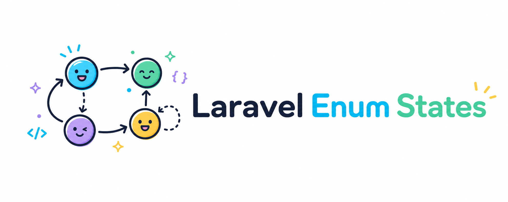

<p align="center">
    
</p>

# Laravel Enum States

[](https://packagist.org/packages/innoge/laravel-enum-states)
[](https://github.com/innoge/laravel-enum-states/actions?query=workflow%3Arun-tests+branch%3Amain)
[](https://github.com/innoge/laravel-enum-states/actions?query=workflow%3A"Fix+php+code+style+issues"+branch%3Amain)
[](https://packagist.org/packages/innoge/laravel-enum-states)

**A state machine for Eloquent, built on native PHP enums.**

Your states stay plain enum cases and your models keep their normal casts. The transition graph lives on the enum itself, and fields are registered with a single attribute. No state classes, no model trait, no extra tables.

- **Native enums, not state classes**: a state is an enum case, not a class you create and wire up for every status.
- **The graph lives on the enum**: allowed transitions, the default, and lifecycle hooks are defined in one `configureStateMachine()` method.
- **Just an attribute on the model**: register a field with `#[StateMachine]` and keep your normal casts.
- **Actions with dependency injection**: run invokable classes or closures on enter, leave, or a specific transition, resolved through the container.
- **Validated on save**: invalid transitions throw, and the default is applied automatically when the field is null.

## Why this exists

We wanted a state machine that feels native to Laravel, one you can drop into an API, SPA, Livewire, or Filament app without it fighting the rest of your stack. Most packages model states as objects, so the moment you serialize one to JSON, hydrate it in a Livewire component, or bind it to a Filament field, every layer has to learn about a new type. Here a state is just a native enum: it casts, serializes, and validates everywhere Laravel already understands enums, with nothing extra to register and nothing custom to serialize. One `#[StateMachine]` attribute on your model, the transition graph on the enum, and you're done.

## Installation

Laravel Enum States requires PHP 8.3 or higher and Laravel 12 or 13.

```bash
composer require innoge/laravel-enum-states
```

## Quick start

**1. Cast the field and register it with the `#[StateMachine]` attribute.**

```php
use Illuminate\Database\Eloquent\Model;
use InnoGE\LaravelEnumStates\Attributes\StateMachine;

#[StateMachine('status', OrderStatus::class)]
final class Order extends Model
{
    protected function casts(): array
    {
        return [
            'status' => OrderStatus::class,
        ];
    }
}
```

**2. Define the transition graph on the enum.**

```php
use InnoGE\LaravelEnumStates\Concerns\TransitionsState;
use InnoGE\LaravelEnumStates\Contracts\StateEnum;
use InnoGE\LaravelEnumStates\StateMachine;

enum OrderStatus: string implements StateEnum
{
    use TransitionsState;

    case Pending = 'pending';
    case Paid = 'paid';
    case Shipped = 'shipped';
    case Cancelled = 'cancelled';

    public static function configureStateMachine(StateMachine $machine): StateMachine
    {
        return $machine
            ->default(self::Pending)
            ->allow(self::Pending, [self::Paid, self::Cancelled])
            ->allow(self::Paid, [self::Shipped, self::Cancelled]);
    }
}
```

**3. Transition with normal enum assignment.**

```php
$order->status = OrderStatus::Paid;
$order->save();
```

The transition is validated when the model is saved. An invalid transition throws `InvalidStateTransition`, and the default is applied on save when the field is null.

## Transitions

`allow()` accepts a single state or an array on either side, so one call can express one-to-one, one-to-many, many-to-one, or many-to-many transitions:

```php
->allow(self::Pending, self::Paid)

->allow(self::Pending, [self::Paid, self::Cancelled])

->allow([self::Pending, self::Paid], self::Cancelled)

->allow([self::Pending, self::Paid], [self::Cancelled, self::Shipped])
```

## Actions

Actions run after the model is saved. Attach them to a specific transition, or to entering or leaving any state. They can be invokable classes or closures:

```php
public static function configureStateMachine(StateMachine $machine): StateMachine
{
    return $machine
        ->default(self::Pending)
        ->onEntering(self::Cancelled, [MarkOrderAsCancelled::class])
        ->onLeaving(self::Paid, [ReleaseInventoryHold::class])
        ->allow(self::Pending, self::Paid, actions: [
            MarkOrderAsPaid::class,
        ])
        ->allow(self::Paid, self::Cancelled, actions: [
            function (Order $model, self $from, self $to, string $field, array $context, AuditLogger $audit): void {
                $audit->record($model, $from, $to, $field, $context);
            },
        ]);
}
```

Class-based actions are resolved through Laravel's container, so you can inject any dependency:

```php
final readonly class MarkOrderAsPaid
{
    public function __construct(private PaymentGateway $payments) {}

    public function __invoke(Order $model, OrderStatus $from, OrderStatus $to, string $field, array $context): void
    {
        $this->payments->capture($model);
    }
}
```

Actions receive `model`, `from`, `to`, `field`, and `context`, plus any other type-hinted dependency the container can resolve. When a transition has all three kinds, they run in order: **leaving** actions, then **entering** actions, then **transition-specific** actions.

To pass context into your actions, use the enum method instead of plain assignment:

```php
$order->status->transitionTo($order, 'status', OrderStatus::Cancelled, reason: 'customer_request');
$order->save();
```

Additional named arguments arrive as the `$context` array on every action for that transition.

The field name is required because enum cases are singletons and do not know which model attribute returned them:

```php
$order->status->transitionTo(
    $order,
    'status',
    OrderStatus::Cancelled,
    reason: 'customer_request',
);
```

The field argument selects the model field and is not included in the action context.

## Helpers

Check transitions from a model's current state, or statically from any state:

```php
$order->status->canTransitionTo(OrderStatus::Paid);   // bool
$order->status->transitionableStates();                // OrderStatus[]

OrderStatus::canTransition(OrderStatus::Pending, OrderStatus::Paid);
OrderStatus::transitionableStatesFrom(OrderStatus::Pending);
```

Build option lists for a frontend with `StateOptions`:

```php
use InnoGE\LaravelEnumStates\StateOptions;

StateOptions::all(OrderStatus::class);                          // value => label, every case
StateOptions::enabled(OrderStatus::class, $order->status);      // current state + reachable states
StateOptions::disabledValues(OrderStatus::class, $order->status); // values that should be disabled
```

If a case has a `getLabel()` method, for example through Filament's `HasLabel` contract, that label is used automatically.

<details>
<summary><strong>Filament select field</strong></summary>

<br>

Install `filament/forms` and use `EnumStateSelect` instead of building options by hand. The current and reachable states are enabled; everything else is disabled:

```php
use InnoGE\LaravelEnumStates\Filament\EnumStateSelect;

EnumStateSelect::make('status')
    ->stateEnum(OrderStatus::class);
```

By default the field reads the live Livewire state. To base the options on the persisted record instead, pass the current state explicitly:

```php
EnumStateSelect::make('status')
    ->stateEnum(OrderStatus::class)
    ->currentState(fn (?Order $record): ?OrderStatus => $record?->status);
```

</details>

<details>
<summary><strong>Validating transitions in form requests</strong></summary>

<br>

Use the `ValidStateTransition` rule to reject invalid transitions before saving:

```php
use InnoGE\LaravelEnumStates\Rules\ValidStateTransition;

'status' => [
    'required',
    new ValidStateTransition($order, 'status'),
],
```

Backed enums are validated by the submitted value; pure enums by the submitted case name.

</details>

<details>
<summary><strong>How saving, events, and transactions work</strong></summary>

<br>

Guarantees are enforced through Eloquent model events. Validation and defaults run on the `saving` event; actions run on the `saved` event.

When the save is already transactional (`saveOrFail()` or an explicit `DB::transaction()`), actions run inside that transaction. Bulk query updates (`Order::where(...)->update(...)`) and quiet saves bypass model events, so they are **not** validated by this package.

Queries already understand enum values, so no helper is needed for reads:

```php
Order::where('status', OrderStatus::Paid)->get();
Order::whereNot('status', OrderStatus::Cancelled)->get();
```

</details>

## How it compares

This package is for teams who want a state machine that stays close to native PHP enums and Eloquent: the transition graph on the enum, fields wired up with an attribute, and no extra tables unless you add them. The trade-off to weigh is **state-as-enum vs. state-as-object**: enums serialize and validate across an API, SPA, Livewire, or Filament for free, while state-object approaches give each state its own class to hang behavior on but need extra handling to cross those boundaries. If you need per-state behavior classes, persisted history, or diagrams out of the box, one of the alternatives below may fit better.

| Package | States defined as | Per-state classes | History table | Notes |
| --- | --- | --- | --- | --- |
| **innoge/laravel-enum-states** | Native enum + fluent graph | No | No | Attribute on the model, no trait; actions with DI; validation + Filament helpers |
| [spatie/laravel-model-states](https://github.com/spatie/laravel-model-states) | A class per state | Yes | No | The state pattern in full, great when each state carries its own behavior, at the cost of more classes to write and register |
| [asantibanez/laravel-eloquent-state-machines](https://github.com/asantibanez/laravel-eloquent-state-machines) | State-machine class per field | No | Yes | Built-in persisted history, responsible user, and scheduled/postponed transitions; more setup and tables |
| [sebdesign/laravel-state-machine](https://github.com/sebdesign/laravel-state-machine) | Config arrays (Symfony Workflow) | No | No | Framework-agnostic and works on any subject, but the graph lives in config rather than a type-safe enum |
| [TamkeenTech/laravel-enum-state-machine](https://github.com/TamkeenTech/laravel-enum-state-machine) | Native enum (`transitions()` via match) | No | Yes | Closest in spirit; ships DB history and diagram generation, but requires a `HasStateMachines` trait and has no enter/leave or per-transition actions |

## Testing

```bash
composer run-checks
composer test:coverage
```

## License

The MIT License (MIT). Please see [License File](LICENSE.md) for more information.
